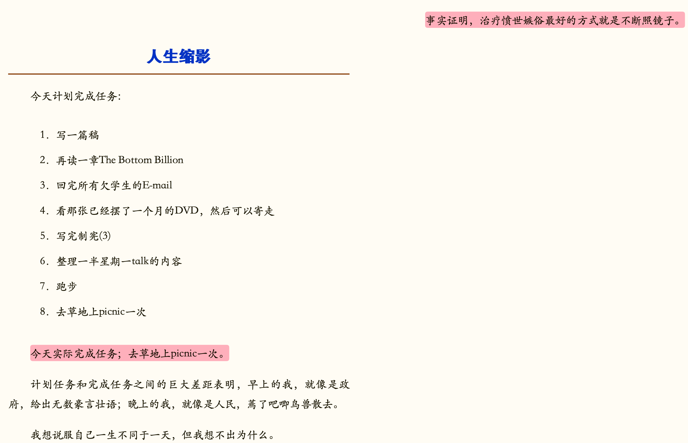

- 刘瑜《毛姆》
	- “是他笔下那些“没有故乡的人”。他写一个人在异域文化中的脆弱感，以及从异域返回本土时同样强烈的隔阂感，非常细腻，简直可以搬来描述今天的中国“海归”。空间的游移，加上时代的沧海桑田，使得那种无家可归感有了双重含义。”
- 苏轼《和子由绳池怀旧》#宋词
	- > 人生到处和相似，应似飞鸿踏雪泥。
	  泥上偶然留指爪，鸿飞那复计东西。
	  老僧已死成新塔，坏壁无由见旧题。
	  往日崎岖还记否，路长人困骞驴嘶。
- 李之仪 《卜算子》#宋词
	- >我住长江头，君住长江尾，日日思君不见君，共饮长江水。
	  此水几时休？此恨何时已。只愿君心似我心，定不负相思意。
- 刘禹锡 《和杨师皋给事伤小姬英英》#唐诗
	- > 见学胡琴见艺成，今朝追想几伤情。
	  撚弦花下呈新曲。,放拨灯前谢改名。
	  **但是好花皆易落，从来尤物不长生。** 
	  鸾台夜直衣衾冷，云雨无因入禁城。
- 😂😂😂😂😂😂
  {:height 577, :width 821}