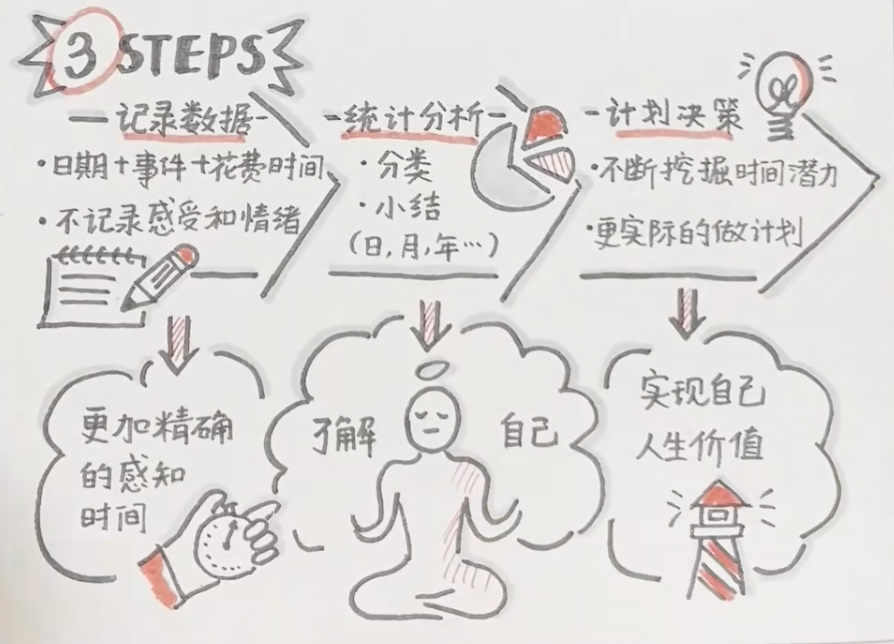

- 
- 戒掉手机的方法：
	- 意识到：不会错过重要的消息是戒掉手机的第一步
	- 行为习惯暗示：在手里握着一个其他的东西
	- 心理暗示：我不玩手机 -- 我不能玩手机，前者有更好的心理暗示
	- 大脑中的奖励结构是固定的：因此必须要制造玩手机的困难，比如视线之外
	- 手机的坏处：减少注意力
- **做一件不想做的事情但是没有办法改变的时候：想想自己可以从中收获什么，带着收获的心态去完成这件事情。**
- 番茄工作法
- **按照日历来生活，并不是一种死板，反而是一种灵活。**
- 去工作环境的地方去工作
- **起床1小时不看手机、每天只查看邮件、slack 一次（日历中体现）、任务中番茄工作法，放松休息法。**
- **记录任务完成的时间，持续记录。**