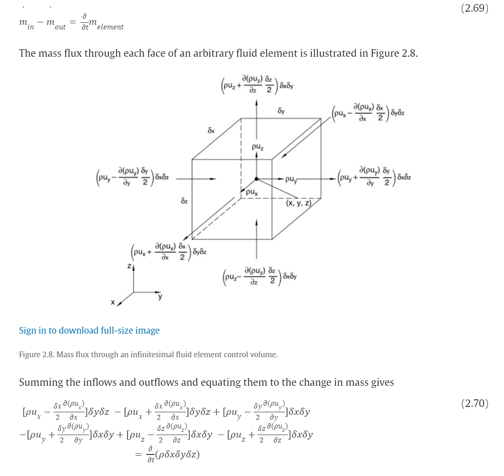

- 信号与系统
  collapsed:: true
	- [[傅里叶变换]]、拉普拉斯变换
		- [深入浅出的讲解傅里叶变换（真正的通俗易懂）-CSDN博客](https://blog.csdn.net/l494926429/article/details/51818012)
	- 卷积
		- {{video https://www.youtube.com/watch?v=QmcoPYUfbJ8}}
	- 奈奎斯特定理
		- {{video https://www.youtube.com/watch?v=Jv5FU8oUWEY}}
- 高等数学
  collapsed:: true
	- 常微分方程
		- [常微分方程复习总结笔记 - 知乎 (zhihu.com)](https://zhuanlan.zhihu.com/p/625101002)
		- [常系数非齐次线性微分方程（两种常见形式）-CSDN博客](https://blog.csdn.net/SanyHo/article/details/106065374)
	- 梯度与散度
		- {{video https://www.youtube.com/watch?v=EW08rD-GFh0}}
		- {{video https://www.youtube.com/watch?v=XbCvGRjjzgg}}
- 物理基础
  collapsed:: true
	- 波动方程的推导
	  collapsed:: true
		- {{video https://www.youtube.com/watch?v=UXqUXYaRyGU}}
		- 连续性方程推导「使用到了泰勒展开来表达边缘处的密度变化」
			- 
	- 激光谐振腔工作原理
		- [激光谐振腔](https://blog.csdn.net/HiWangWenBing/article/details/128054137#:~:text=%E8%B0%90%E6%8C%AF%E8%85%94%E7%94%B1%E5%A6%82%E4%B8%8B%E7%BB%84%E4%BB%B6,%E4%BD%BF%E4%B9%8B%E6%BB%A1%E8%B6%B3%E9%98%88%E5%80%BC%E6%9D%A1%E4%BB%B6%E3%80%82)
		- [Q开关](https://blog.csdn.net/HiWangWenBing/article/details/125819240)
-