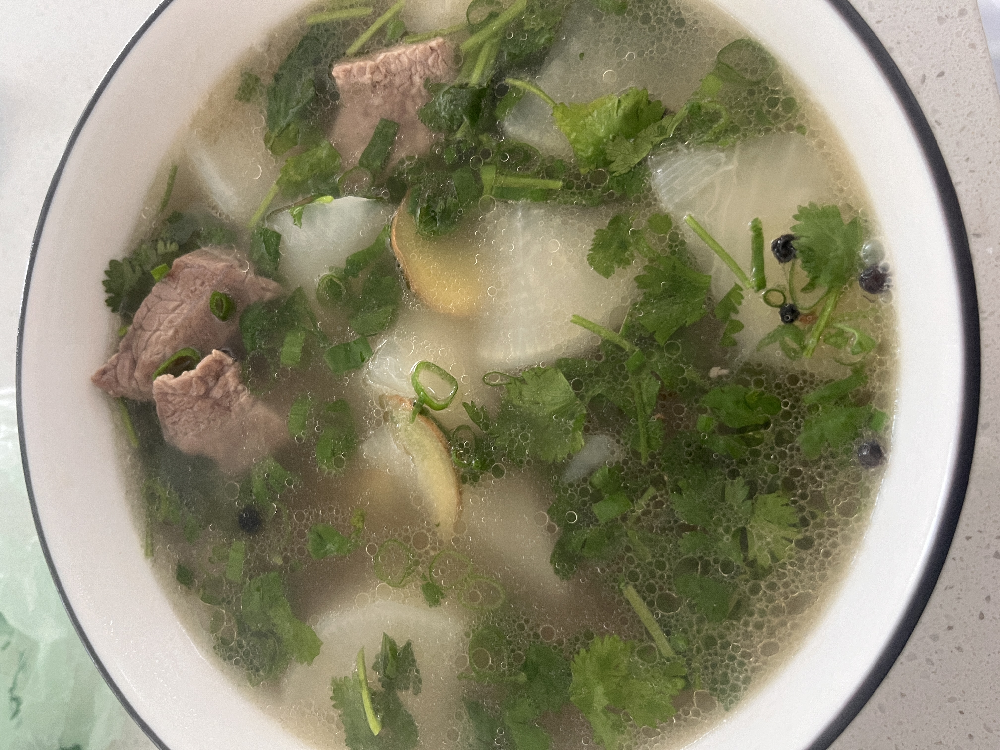
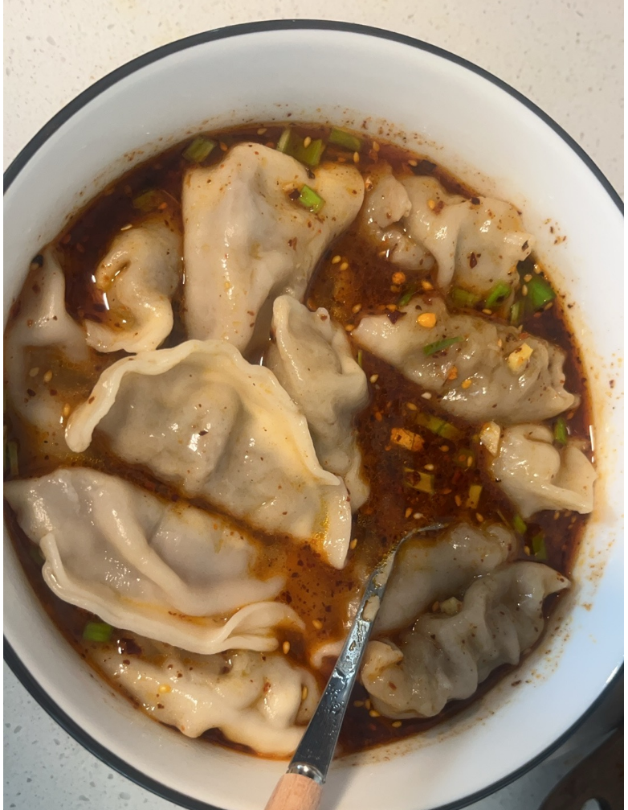
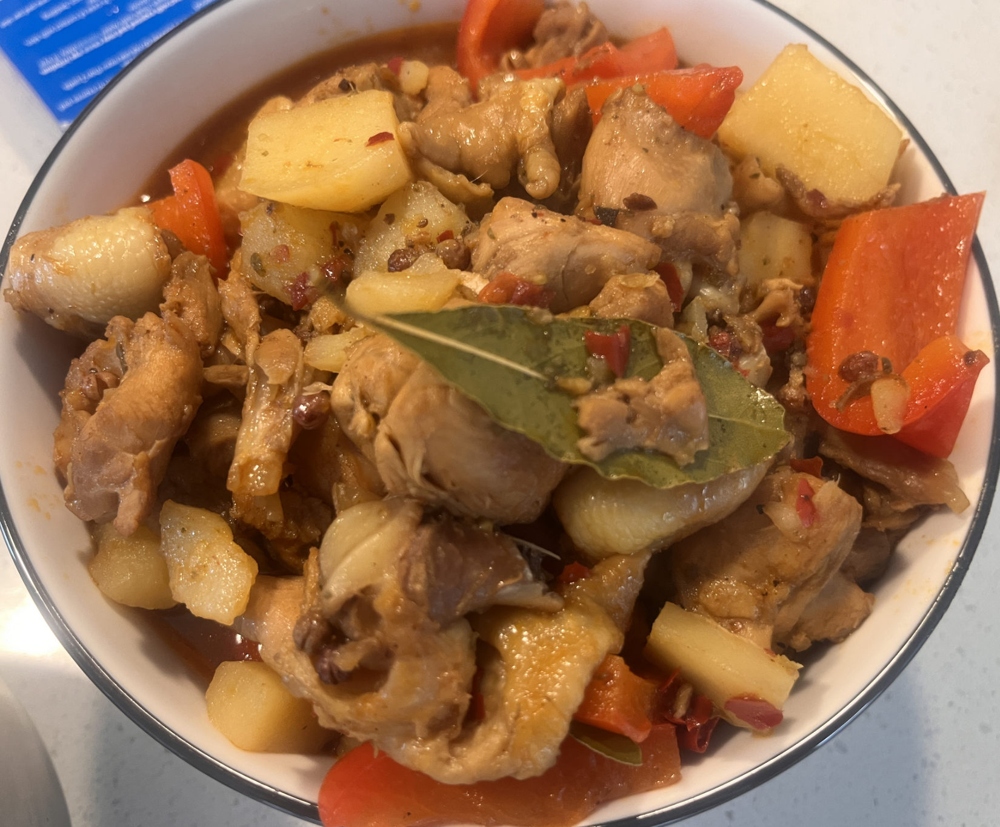
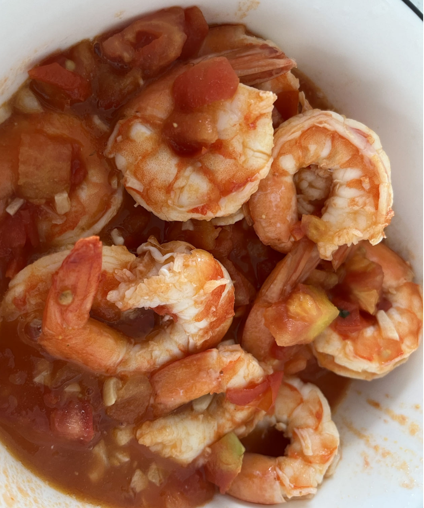

- 已成功
  collapsed:: true
	- 清炖牛肉：
	  collapsed:: true
		- 食材：牛肉
		- 调料：葱姜蒜、白萝卜、胡椒、盐
		- 步骤：焯水、葱姜牛肉翻炒、**加热水**
		- 成品照片 
		  {:height 269, :width 210}
	- 红油水饺
	  collapsed:: true
		- 调料：辣椒面、油泼辣子、耗油、生抽、醋、蒜末、姜末、葱末
		- 步骤：上述调料加进去之后，**泼上一点热油**，最后调盐味
		- 成品照片
		  {:height 265, :width 216}
	- 大盘鸡or火锅鸡
	  collapsed:: true
		- 食材：鸡肉、土豆、甜椒
		- 调料：冰糖、火锅底料、花椒、香叶、八角、料酒、盐
		- 步骤： ①焯水②**炒糖色（热油化冰糖，融化之后加入焯水后的鸡肉）**、火锅底料翻炒、香料（花椒、八角香叶）翻炒、加入料酒翻炒③加水煮沸、加入土豆、最后加入甜椒、洋葱等绿色蔬菜④加盐调味
		- 成品照片：
		  {:height 327, :width 230}
- 失败
  collapsed:: true
	- 番茄焖虾
	  collapsed:: true
		- 食材：虾、番茄
		- 调料：蒜
		- 步骤：①炒香蒜末②加入番茄块和盐出汁③加入虾
		- 失败原因：番茄过少（番茄和虾的比例）、番茄酱没有使用、盐也加的少
		- 照片
		  {:height 382, :width 310}
- 待尝试
  collapsed:: true
	- 番茄牛肉
	  collapsed:: true
		-  
	- 红烧牛肉
	  collapsed:: true
		- 火锅底料