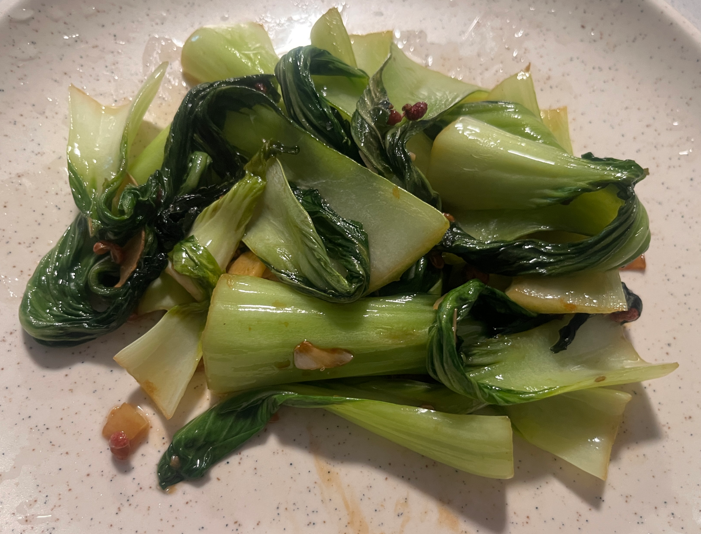
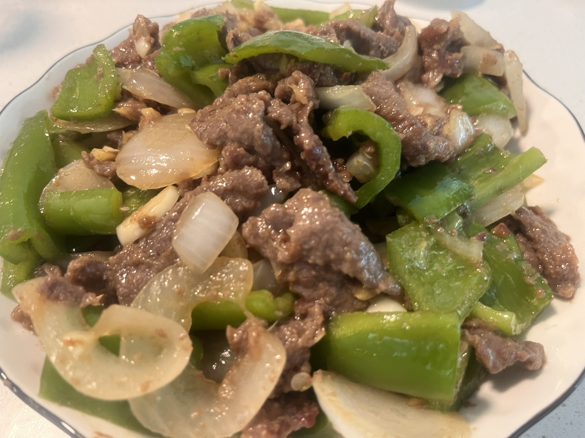
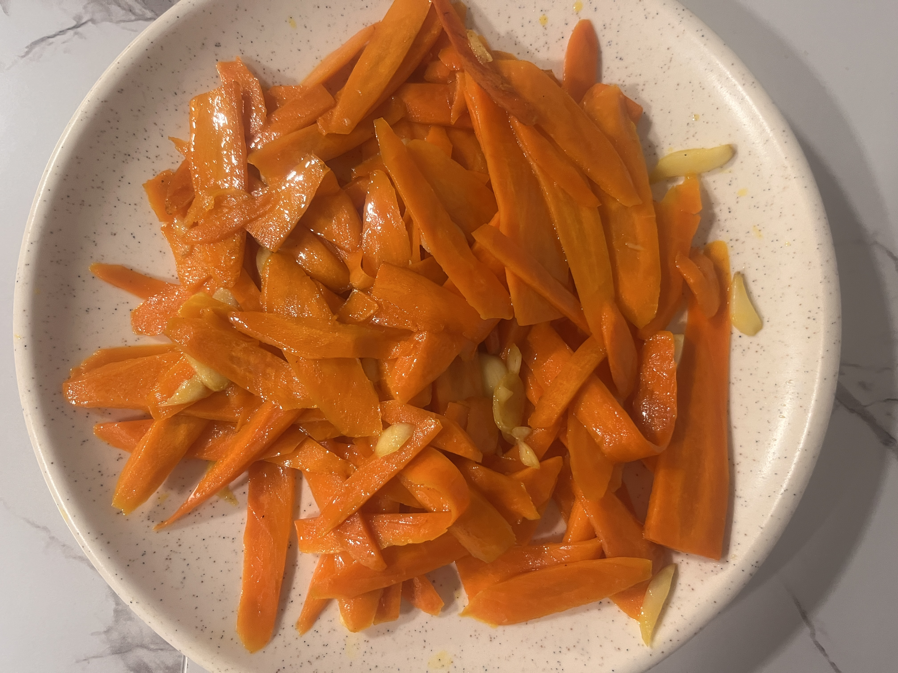
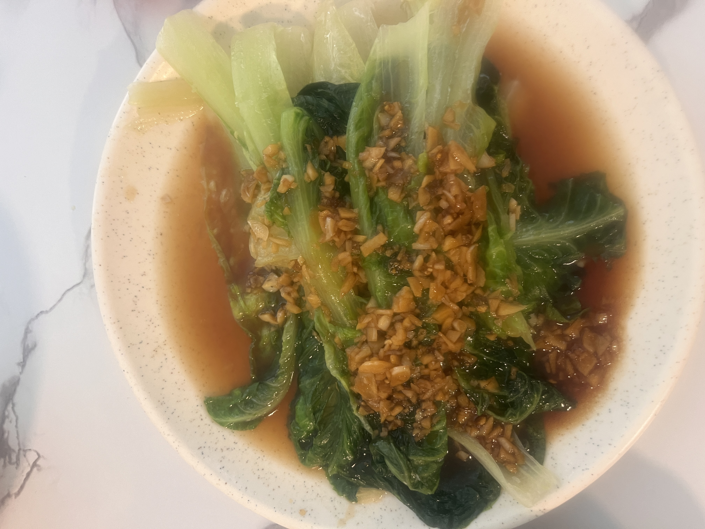
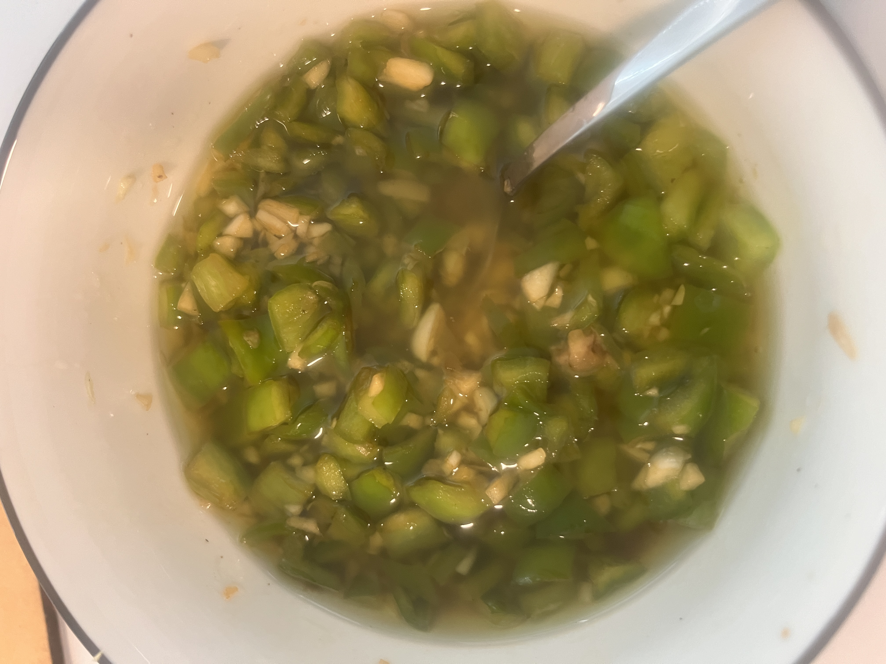
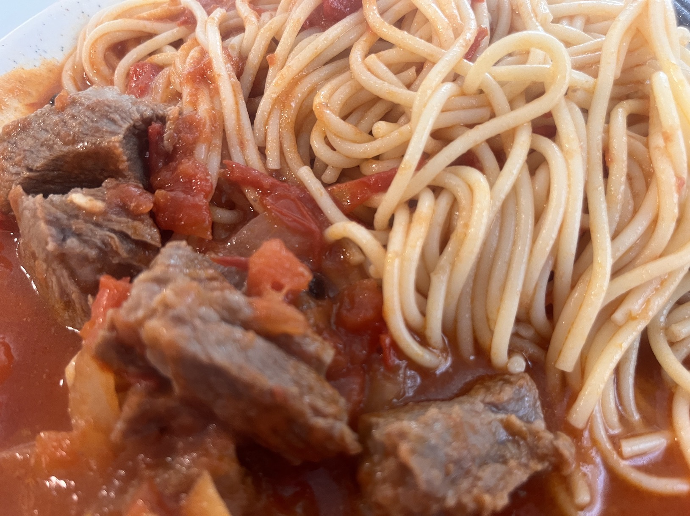
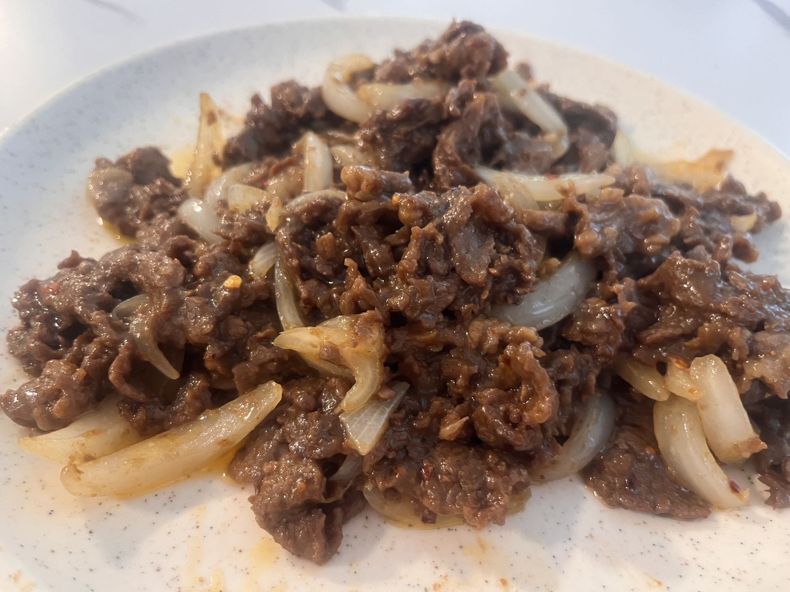

- 已成功
	- 清炖牛肉
	  collapsed:: true
		- 食材：牛肉
		- 调料：葱姜蒜、白萝卜、胡椒、盐
		- 步骤：焯水、葱姜牛肉翻炒、**加热水**
		- 成品照片 
		  {:height 269, :width 210}
	- 红油水饺
	  collapsed:: true
		- 调料：辣椒面、油泼辣子、耗油、生抽、醋、蒜末、姜末、葱末
		- 步骤：上述调料加进去之后，**泼上一点热油**，最后调盐味
		- 成品照片
		  {:height 265, :width 216}
	- 大盘鸡or火锅鸡
	  collapsed:: true
		- 食材：鸡肉、土豆、甜椒
		- 调料：冰糖、火锅底料、花椒、香叶、八角、料酒、盐
		- 步骤： ①焯水②**炒糖色（热油化冰糖，融化之后加入焯水后的鸡肉）**、火锅底料翻炒、香料（花椒、八角香叶）翻炒、加入料酒翻炒③加水煮沸、加入土豆、最后加入甜椒、洋葱等绿色蔬菜④加盐调味
		- 成品照片：
		  {:height 327, :width 230}
	- 炝炒青菜
	  collapsed:: true
		- 食材：青菜
		- 调料：姜末、蒜末、花椒、耗油
		- 步骤：油热下锅姜末蒜末花椒，炒香后加入青菜，调味阶段加入耗油和盐
		- 成品照片：
			- {:height 238, :width 293}
	- 青椒炒牛肉
	  collapsed:: true
		- 食材：costco牛肉、青椒、洋葱
		- 调料：葱姜蒜、料酒、生抽、淀粉、小苏打、白胡椒、鸡蛋、食用油
		- 步骤：腌制、炒辣椒洋葱、
		- 成品照片：
		- {:height 248, :width 307}
	- 炒胡萝卜
	  collapsed:: true
		- 食材：胡萝卜
		- 调料：蒜片
		- 步骤：热油下蒜片，炒香后加入胡萝卜片，最后加盐调味
		- 成品照片：
			- {:height 355, :width 252}
	- 蚝油生菜
	  collapsed:: true
		- 食材：生菜
		- 调料：蒜末、蚝油
		- 步骤：①生菜先汆汤，水中加入盐和油保持绿色②炒料：热油下蒜末，炒香后加入蚝油，加水，浓稠后浇淋在生菜上
		- 成品照片：
			- {:height 345, :width 245}
	- 青椒蒜末酱
	  collapsed:: true
		- 食材：青椒、蒜末
		- 调料：盐、生抽、醋
		- 步骤：①青椒切末（碎一点）热锅炒软②在碗中搅匀青椒末和蒜末③热油分三次浇淋在青椒末和蒜末的搅拌物上④搅拌均匀⑤加入生抽、醋、盐调味。
		- 成品照片：
			- {:height 310, :width 221}
	- 番茄牛腩
	  collapsed:: true
		- 食材：番茄、costco牛肉
		- 调料：八角香叶黑胡椒蒜片洋葱
		- 步骤：①牛腩切块焯水，保留一部分焯水的原汁②热油炒调料，炒香后加入番茄酱，再加入牛腩③加入原汁，然后烧开炖煮④中途加入料酒和冰糖，继续炖煮
		- 成品照片：
			- {:height 235, :width 280}
	- 孜然牛肉
	  collapsed:: true
		- 食材：牛肉（最好是纯瘦肉）、洋葱
		- 步骤：①腌制牛肉。加入葱姜蒜（葱姜蒜料酒）、一勺生抽、一勺蚝油、半勺老抽、一勺孜然粉、两勺淀粉，搅拌均匀。②加油炒牛肉至成熟后捞出，再加入洋葱，炒一会儿加入牛肉，最后加入孜然和盐调味。（也可以不用加盐，根据个人口味）
		- 成品照片：
			- {:height 243, :width 296}
- 失败
  collapsed:: true
	- 番茄焖虾
	  collapsed:: true
		- 食材：虾、番茄
		- 调料：蒜
		- 步骤：①炒香蒜末②加入番茄块和盐出汁③加入虾
		- 失败原因：番茄过少（番茄和虾的比例）、番茄酱没有使用、盐也加的少
		- 照片
		  {:height 382, :width 310}
- 待尝试
  collapsed:: true
	- 番茄牛肉
	  collapsed:: true
		-  
	- 红烧牛肉
	  collapsed:: true
		- 火锅底料
- 11112
- 22222